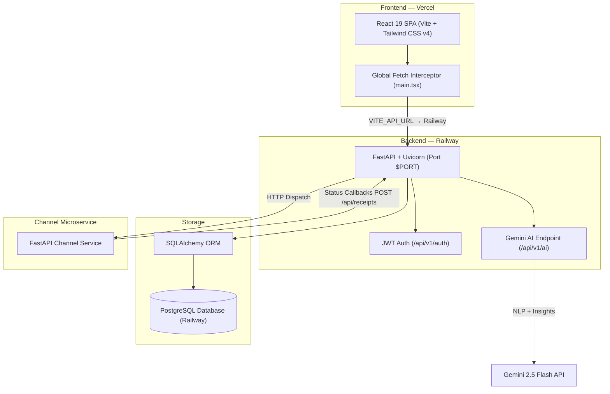

# XenoPulse ⚡
### AI-Native Marketing Operating System for Enterprise Retail Brands

XenoPulse is a high-performance, production-ready marketing operating system for modern retail organizations. Marketing teams can generate data-driven campaigns from natural language using the Gemini API, parse customer segments semantically, run real-time message dispatch simulators, and monitor growth metrics — all backed by a live PostgreSQL database on Railway.

---

## 🌐 Live Deployments

| Component | Platform | URL |
| :--- | :--- | :--- |
| **Frontend Client** | Vercel | [xeno-assisgenement.vercel.app 🚀](https://xeno-assisgenement.vercel.app/) |
| **Backend API** | Railway | [xenopulse-crm-backend-production.up.railway.app ⚙️](https://xenopulse-crm-backend-production.up.railway.app/) |
| **Database** | Railway PostgreSQL | Managed PostgreSQL (Oregon, US) |

---

## 🏗️ System Architecture

XenoPulse is a fully decoupled monorepo: a static React SPA on Vercel, a FastAPI backend on Railway, backed by a managed PostgreSQL database.



---

## 📷 UI Gallery

### ⚡ Insights Engine Dashboard


### 🧠 AI Command Center


### 📊 Customer Intelligence & Analytics


### 🚀 Campaign Studio & Dispatcher


### 🎯 Audience Segment Planner


---

## ⚡ Core Features

### 🧠 AI Command Center & Semantic Segment Builder
- **Natural Language → SQL**: Parses inputs like *"Chennai VIP customers who spent over ₹50,000 and haven't ordered in 45 days"* into structured filters using Gemini 2.5 Flash.
- **Dynamic DB Context**: Queries live PostgreSQL counts before calling Gemini so recommendations are always accurate.

### 🔄 Real-Time Campaign Simulator
- **Delivery Lifecycle**: `QUEUED → SENT → DELIVERED → READ → CLICKED → CONVERTED`
- **Controls**: Play/Pause and speed multipliers (`1x`, `2x`, `5x`, `10x`)
- **Callback Receipts**: Delivery events hit `/api/receipts`, update DB stats, and stream live telemetry to the browser.

### 📱 Multi-Channel Message Previewer
- **Live Device Skins**: WhatsApp chat thread, SMS card, RCS media card, Email template — changes automatically by channel.
- **Template Personalization**: Replaces `{first_name}` tokens with live dummy data on every keypress.

### 📊 Insights Engine & AI Churn Alerts
- **Health Scores**: Identifies at-risk customers (score < 50) and triggers targeted recovery campaigns.
- **Recharts Dashboards**: Real-time delivery rates, open/click metrics, and RFM segment charts.

### 🛡️ Role-Based Access Control (RBAC)
- **JWT Sessions**: `python-jose` + `passlib[bcrypt]` token validation on every protected endpoint.
- **Admin vs Manager**: Admins have full CRUD rights; Manager role is blocked from destructive operations (`403 Forbidden`) both on the API and in the UI.

---

## 🛠️ Technology Stack

| Layer | Technology | Version |
| :--- | :--- | :--- |
| Frontend Framework | React | `19.0.1` |
| Build Tool | Vite | `6.2.3` |
| Styling | Tailwind CSS | `4.1.14` |
| Charts | Recharts | `3.8.1` |
| Animations | Motion | `12.23.24` |
| Icons | Lucide React | `0.546.0` |
| WebSocket Sim | Socket.io-client | `4.8.3` |
| Backend Runtime | Python | `3.11+` |
| API Framework | FastAPI + Uvicorn | `≥0.110.0` |
| ORM | SQLAlchemy | `≥2.0.0` |
| Database (Prod) | PostgreSQL | Railway Managed |
| Database (Dev) | SQLite | local |
| Auth | python-jose + passlib[bcrypt] | `≥3.3.0` |
| Validation | Pydantic + pydantic-settings | `≥2.0.0` |
| AI | Google Gemini API | 2.5 Flash |
| PG Driver | psycopg2-binary | `≥2.9.0` |

---

## 📂 Project Structure

```
Xeno-Assisgenement/
├── backend/              ← FastAPI backend (Railway deployment root)
│   ├── app/
│   │   ├── api/v1/       ← Route handlers (auth, customers, campaigns, ai…)
│   │   ├── core/         ← Config, DB engine, security utils
│   │   ├── crud/         ← Database operations
│   │   ├── models/       ← SQLAlchemy ORM models
│   │   ├── schemas/      ← Pydantic schemas
│   │   ├── seed.py       ← Seeds 1,000 customers + 5,000 orders on startup
│   │   └── main.py       ← App entry point + auto-seed on cold start
│   ├── railway.json      ← Railway deployment config
│   ├── requirements.txt  ← Python dependencies
│   └── .env              ← Local dev environment (git-ignored)
├── frontend/             ← React SPA (Vercel deployment)
│   ├── src/
│   │   ├── main.tsx      ← Global fetch interceptor (API routing + auth)
│   │   └── App.tsx       ← Root component + role-based routing
│   ├── .env.example      ← Required environment variables
│   └── vite.config.ts    ← Vite config (proxy, envPrefix)
├── channel-service/      ← Message dispatch microservice
├── Procfile              ← Fallback start command for Railway
├── railway.json          ← Root Railway config
├── vercel.json           ← Vercel SPA rewrite rules
└── deploy_steps.md       ← Full production deployment guide
```

---

## 🚀 Local Development

### Prerequisites
- **Node.js** v18+
- **Python** v3.11+

### 1. Backend Setup
```bash
cd backend

# Create virtual environment
python -m venv venv

# Activate (Windows)
.\\venv\\Scripts\\activate
# Activate (macOS/Linux)
source venv/bin/activate

pip install -r requirements.txt
```

Create `backend/.env`:
```env
DATABASE_URL=sqlite:///./sql_app.db
GEMINI_API_KEY=your_gemini_api_key_here
SECRET_KEY=xenopulse_super_secret_jwt_key_2026
ACCESS_TOKEN_EXPIRE_MINUTES=11520
```

Start the backend (auto-seeds DB on first run):
```bash
python -m uvicorn app.main:app --port 8000
```
API docs: `http://localhost:8000/docs`

### 2. Channel Service Setup
```bash
cd channel-service
python -m venv venv
.\\venv\\Scripts\\activate   # or: source venv/bin/activate
pip install -r requirements.txt
python -m uvicorn app.main:app --port 8001
```

### 3. Frontend Setup
```bash
cd frontend
npm install
```

Create `frontend/.env.local`:
```env
# For local dev, leave blank (Vite proxy handles /api → localhost:8000)
# VITE_API_URL=http://localhost:8000
```

```bash
npm run dev
```
Open **`http://localhost:5173`**

---

## 🔐 Default Credentials

| Role | Email | Password | Dashboard |
| :--- | :--- | :--- | :--- |
| Admin | `admin@xenopulse.com` | `admin123` | Insights Engine |
| Admin (alt) | `admin@xenopulse.ai` | `admin123` | Insights Engine |
| Marketing Manager | `manager@xenopulse.com` | `manager123` | AI Command Center |

> **Credentials are seeded automatically** into PostgreSQL (production) or SQLite (local) on the first cold start.

---

## ☁️ Production Deployment

See **[`deploy_steps.md`](deploy_steps.md)** for the complete guide. Summary:

### Railway (Backend)
1. Connect GitHub repo → set **Root Directory** to `backend`
2. Set environment variables:

```
DATABASE_URL=postgresql://postgres:<password>@<host>:<port>/railway
SECRET_KEY=<random-long-string>
GEMINI_API_KEY=<your-key>
PYTHONPATH=.
ACCESS_TOKEN_EXPIRE_MINUTES=11520
```

3. Start command (auto-detected from `railway.json`):
```
uvicorn app.main:app --host 0.0.0.0 --port $PORT
```

### Vercel (Frontend)
1. Connect GitHub repo → **Root Directory**: `/` (uses root `vercel.json`)
2. Set environment variable:

```
VITE_API_URL=https://<your-backend>.up.railway.app
```

3. Vercel auto-runs: `npm install --prefix frontend && npm run build --prefix frontend`

---

## 🗃️ Database

| Environment | Database | Details |
| :--- | :--- | :--- |
| Production | PostgreSQL | Railway Managed Instance (Oregon, US) |
| Local Dev | SQLite | `backend/sql_app.db` (auto-created) |

On **first startup**, the backend automatically:
- Creates all tables via `Base.metadata.create_all()`
- Seeds **1,000 customers** with RFM scores, city, tags, and order history
- Seeds **5,000 orders** distributed across VIP, repeat, and casual cohorts
- Creates **3 default segments** (VIP, Active Buyers, Inactive Leads)
- Creates **2 sample campaigns** with pre-filled metrics

---

## 📡 Key API Endpoints

| Method | Endpoint | Description |
| :--- | :--- | :--- |
| `GET` | `/health` | Health check |
| `POST` | `/api/v1/auth/login` | Login → returns JWT |
| `GET` | `/api/v1/auth/me` | Current user profile |
| `GET` | `/api/v1/customers/` | Paginated customer list |
| `GET` | `/api/v1/campaigns/` | All campaigns |
| `POST` | `/api/v1/campaigns/{id}/launch` | Launch campaign |
| `POST` | `/api/v1/ai/command` | AI goal → campaign strategy |
| `POST` | `/api/v1/ai/segment` | NL prompt → audience filter |
| `GET` | `/api/v1/analytics` | Global delivery metrics |
| `POST` | `/api/receipts` | Delivery callback receipt |
