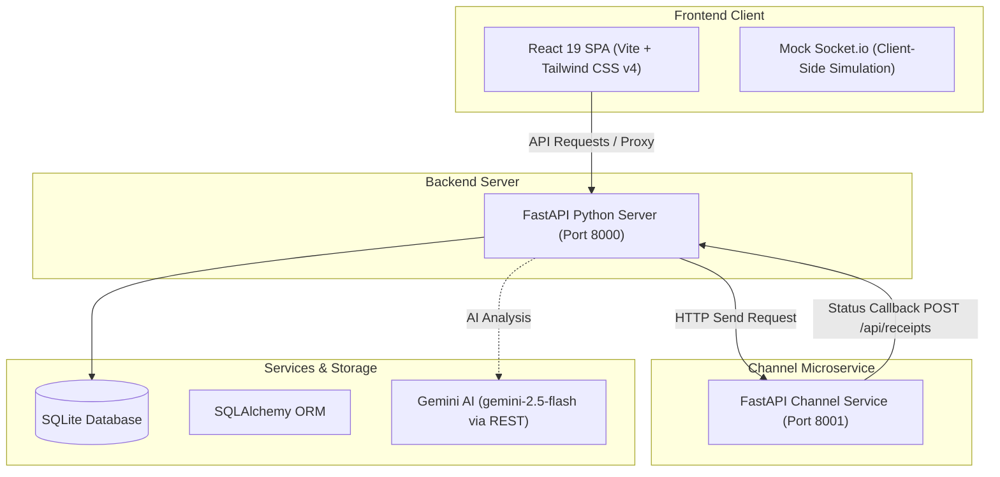

# XenoPulse ⚡
### AI-Native Marketing Operating System for Enterprise Retail Brands

XenoPulse is a high-performance, production-ready marketing operating system designed for modern retail organizations. The platform enables marketing teams to switch between active brand workspaces, generate data-driven campaigns from natural language using the Gemini API, parse customer segments semantically, run real-time message dispatch simulators, and monitor growth metrics instantly.

## 🌐 Live Deployments

| Component | Service Platform | Deployment URL |
| :--- | :--- | :--- |
| **Frontend Client** | Vercel | [xeno-assisgenement.vercel.app 🚀](https://xeno-assisgenement.vercel.app/) |
| **Backend API Server** | Railway | [xenopulse-crm-backend-production.up.railway.app ⚙️](https://xenopulse-crm-backend-production.up.railway.app/) |

---

## 🏗️ System Architecture

XenoPulse is architected as a fully decoupled monorepo split into an independent static frontend, a stateless Python/FastAPI backend, and a dedicated message dispatch microservice:



---

## ⚡ Core Capabilities & Features

### 🏢 Brand Tenancy Configuration
* **Database-Level Partitioning**: Multi-tenant database model isolating customer records, orders, and campaigns.
* **Shared Pool Tenancy**: Shared database schema where Admins and Managers have contextual role-based control panels to provision users and view campaigns.

### 🧠 AI Command Center & Semantic Segment Builder
* **Dynamic Database Context Feeding**: Scans the database to query target segment size and passes active cohort counts to Gemini. This allows the AI model to recommend high-impact message templates and predict click-through rates.
* **Natural Language Queries**: Uses Gemini to parse conversational inputs (e.g., *"Chennai VIP customers who spent more than 50,000 rupees and have been inactive for 45 days"*) into structured query filters.

### 🔄 Real-time Campaign Simulator Loop & Controls
* **Decoupled Async Processing**: Launching a campaign initiates background tasks that simulate recipient message delivery lifecycles (`SENT` -> `DELIVERED` -> `READ` -> `CLICKED` -> `CONVERTED`).
* **Simulation Controls**: Play/Pause controls and speed multipliers (`1x`, `2x`, `5x`, `10x`) allow adjusting the live ticker rate or halting execution in-flight.
* **Callback Receipts**: Integrates callback endpoints (`/api/receipts`) to log delivery events, update stats, and broadcast live telemetry to the browser via the simulated socket.
* **Dynamic Database Side-Effects**: Simulated conversions dynamically feed order histories, instantly recalculating customer metrics in real-time.

### 📱 Interactive Multi-Channel Campaign Previewer
* **Device Mockup Skins**: Smartphone skin rendering changes contextually based on the chosen marketing channel (WhatsApp chat thread UI, SMS message card, RCS media card with suggested reply action chips, or styled Email details template).
* **Real-time Personalization Parsing**: Dynamically replaces template parameters such as `{first_name}` with realistic dummy data (`Alex`) on keypress events.

### 📊 Historical Campaign Performance & AI Churn Alerts
* **AI Insights Engine**: Scanning client records for drop-off risks with health scores below 50. A "Rescue" button triggers redirection to the Campaign Studio and preloads recovery templates for the target user instantly.
* **Recharts Dashboard**: Real-time visualization of campaigns performance, delivery/open/click rates, and live status change updates.

### 🛡️ Role-Based Access Control (RBAC)
* **JWT Token Verification**: Restricts administrative capabilities (such as customer profile deletion/pruning) using RBAC. Attempts by managers to invoke deletion API endpoints are rejected on the backend (`403 Forbidden`) and blocked on the client.

---

## 🛠️ Technology Stack

| Component | Version | Description |
| :--- | :--- | :--- |
| **Frontend Framework** | React `19.0.1` | High-performance client SPA |
| **Build Tool** | Vite `6.2.3` | Lightning-fast frontend tooling |
| **Styling** | Tailwind CSS `4.1.14` | Utility-first CSS framework |
| **Charts** | Recharts `3.8.1` | Vibrant interactive dashboards |
| **UI Icons** | Lucide React `0.546.0` | Clean icon system |
| **Animations** | Motion `12.23.24` | Smooth micro-animations |
| **WebSockets (Client)** | Socket.io-client `4.8.3` | Custom MockSocket real-time event simulation |
| **Backend Runtime** | Python `3.10+` | High-performance async backend |
| **API Framework** | FastAPI `≥0.110.0` + Uvicorn `≥0.28.0` | REST API & ASGI server |
| **ORM** | SQLAlchemy `≥2.0.0` | Database modeling and queries |
| **AI Integration** | Gemini API | Gemini 2.5 Flash NLP & insights |
| **Auth** | python-jose `≥3.3.0` + passlib[bcrypt] `≥1.7.4` | JWT sessions and password hashing |
| **Validation** | Pydantic `≥2.0.0` + pydantic-settings `≥2.0.0` | Request/response schema enforcement |

---

## 📂 Project Structure

The repository is organized into independent folder workspaces:
* [**`frontend/`**](file:///e:/Xeno-Assisgenement/frontend): Standalone client-side application (React 19 + Vite + Tailwind CSS v4).
* [**`backend/`**](file:///e:/Xeno-Assisgenement/backend): FastAPI backend server with SQLAlchemy ORM and SQLite.
* [**`channel-service/`**](file:///e:/Xeno-Assisgenement/channel-service): FastAPI message delivery and receipt callbacks simulator.

---

## 🚀 Local Development Quickstart

### 1. Prerequisites
Ensure you have **Node.js** (v18+) and **Python** (v3.10+).

### 2. Configure Environment Variables
Create a `.env` file in the `backend/` directory:
```env
DATABASE_URL="sqlite:///./sql_app.db"
GEMINI_API_KEY="YOUR_GEMINI_API_KEY"
SECRET_KEY="xenopulse_super_secret_jwt_key_2026"
```

### 3. Setup Backend & Seed Database
```bash
cd backend
python -m venv venv
# Activate virtual environment (Windows):
.\venv\Scripts\activate
# Activate virtual environment (macOS/Linux):
source venv/bin/activate

pip install -r requirements.txt
python -m app.seed # Seeds 1000 customers & 5000 orders
python -m uvicorn app.main:app --port 8000
```
API docs will be live at `http://localhost:8000/docs`.

### 4. Setup Channel Service
```bash
cd channel-service
python -m venv venv
# Activate virtual environment (Windows):
.\venv\Scripts\activate

pip install -r requirements.txt
python -m uvicorn app.main:app --port 8001
```

### 5. Setup Frontend
```bash
cd frontend
npm install
npm run dev
```
Open **`http://localhost:5173`** to access the dashboard!

---

## 🔐 Prefilled Test Credentials
On the Login screen, click either prefill profile button:
* **Admin**: `admin@xenopulse.com` / `admin123` or `admin@xenopulse.ai` / `admin123` (Full pruning permissions)
* **Manager**: `manager@xenopulse.com` / `manager123` (Operational access; customer deletions blocked)
