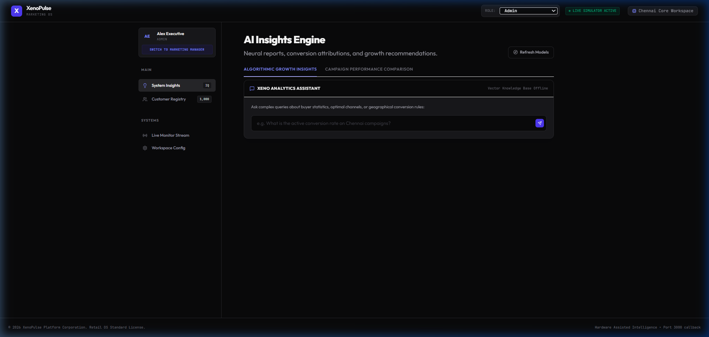
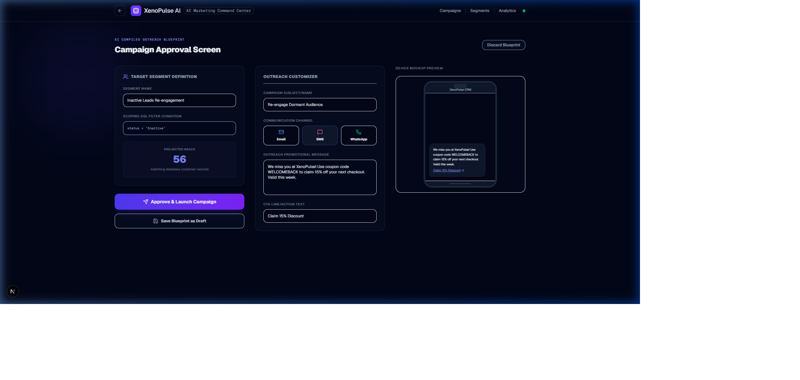
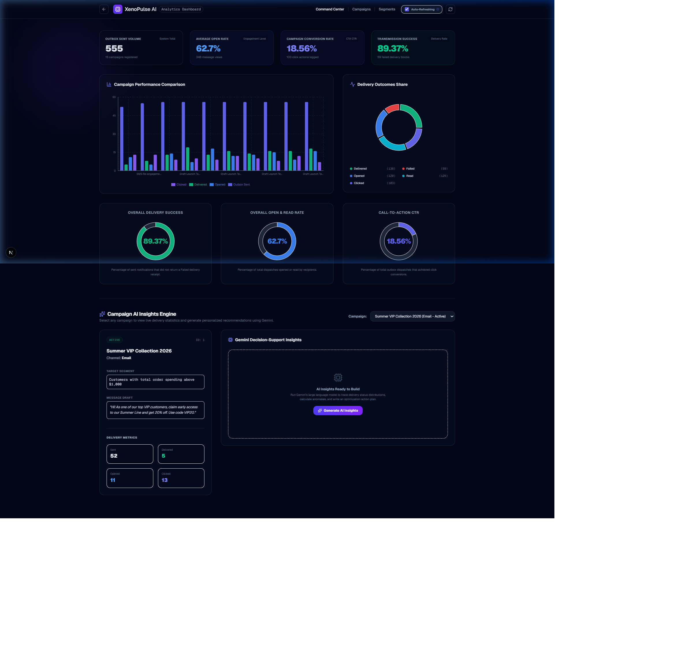
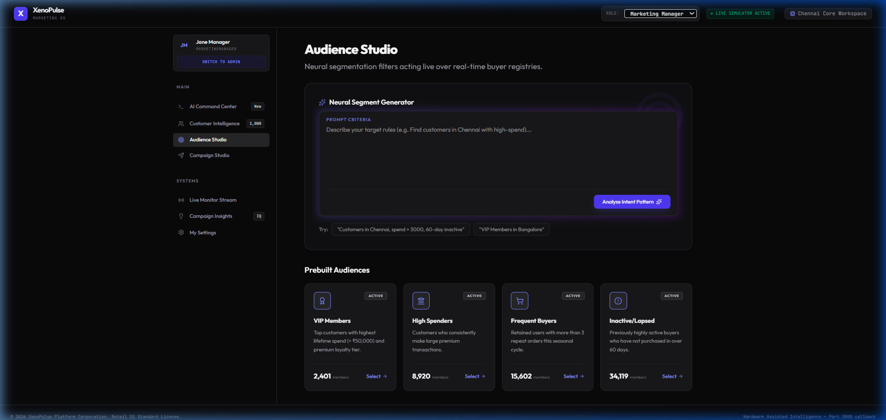
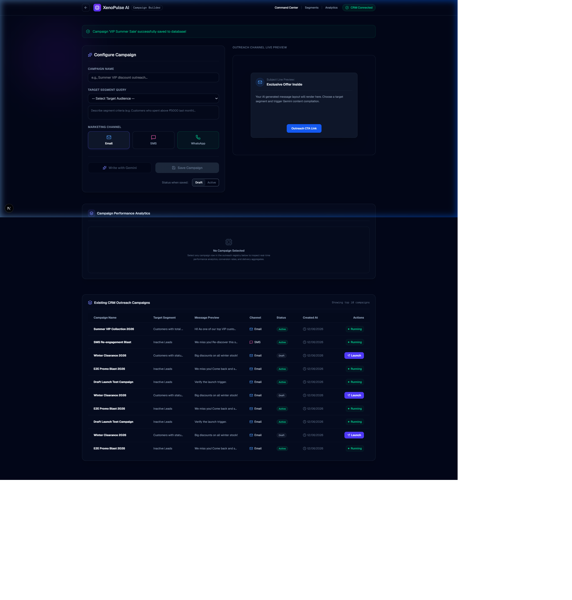
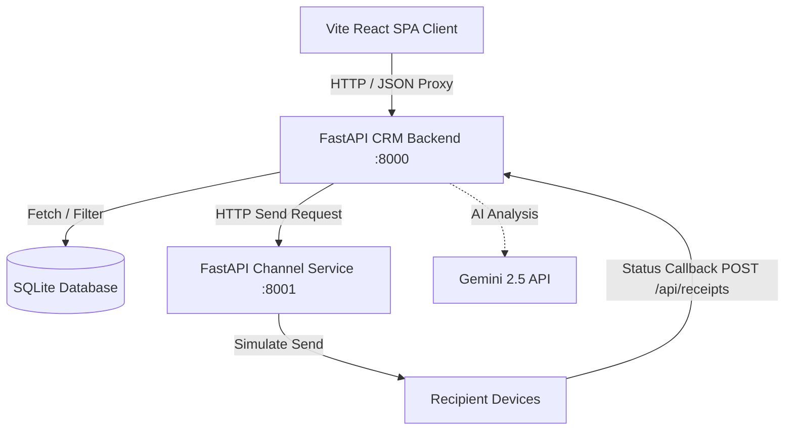

# XenoPulse AI - Marketing Automation & CRM Command Center

XenoPulse AI is a premium, state-of-the-art marketing automation and CRM platform designed for DTC e-commerce brands. By integrating Google Gemini 2.5 Flash models, the system dynamically translates natural language prompts into precise SQL segment filters, crafts conversion-optimized campaign copy, generates analytical insights, and runs an automated campaign outreach pipeline across Email, SMS, and WhatsApp.

---

## Key Features

1. **AI Marketing Command Center**: Translate simple prompts (e.g. *"Increase repeat purchases among premium shoppers"*) into fully realized marketing segment filters, marketing channels, and optimized copy copies, with a step-by-step approval view.
2. **AI Segment Generator**: Query customer cohorts in natural language. Gemini translates the description into SQLite WHERE clauses and evaluates the reach size live.
3. **AI Copywriting & Outreach Preview**: Instant draft copywriting optimized for specific audience segments with live mobile phone mocks for Email, SMS, and WhatsApp modes.
4. **Recharts Analytics Dashboard**: Real-time visualization of campaigns performance, delivery/open/click rates, and live status change updates via polling.
5. **FastAPI Channel Service & Callback Engine**: Fully isolated microservice dispatching message payloads and simulating delivery events (Opened, Read, Clicked) with transactional safety, retries, and duplicate idempotency checks.
6. **Fashion B2C Seeder**: Includes realistic DTC e-commerce dataset (1,000 customers, 5,000 orders) generated using loyalty power-law curves and seasonal shopping weights.

---

## UI Previews

### 1. Brand Home Page


### 2. AI Marketing Command Center


### 3. Real-time Recharts Analytics Dashboard


### 4. Segment Builder & AI SQL Generator


### 5. Campaign Outreach Panel


---

## Project Architecture & Tech Stack



### Stack Components
* **Frontend**: React 19 with Vite SPA (TypeScript, Vanilla CSS, Lucide Icons, Recharts, client-side WebSocket/Socket.io mock simulation).
* **Backend**: FastAPI (Python 3, SQLAlchemy, Pydantic v2, Pydantic Settings, JWT Auth).
* **Channel Microservice**: FastAPI (Python 3, SMTP/SMTP stubs, Twilio SDK stubs).
* **Database**: SQLite with PRAGMA foreign keys enabled.
* **AI Integration**: Gemini 2.5 Flash via REST endpoints.

---

## Instructions to Run Locally

### 1. Run CRM Backend (Port 8000)
```bash
cd backend
python -m venv venv
# Activate virtual environment:
# Windows: .\venv\Scripts\activate
# macOS/Linux: source venv/bin/activate
pip install -r requirements.txt
python -m app.seed # Seeds 1000 customers & 5000 orders
$env:PYTHONPATH="." # Windows Powershell
python -m uvicorn app.main:app --port 8000
```
API docs will be live at `http://localhost:8000/docs`.

### 2. Run Channel Service (Port 8001)
```bash
cd channel-service
python -m venv venv
# Activate virtual environment
pip install -r requirements.txt
$env:PYTHONPATH="."
python -m uvicorn app.main:app --port 8001
```
Service will be live at `http://localhost:8001`.

### 3. Run Frontend (Port 5173)
```bash
cd frontend
npm install
npm run dev
```
Open your browser at `http://localhost:5173`.

### 4. Run Verification Tests
To verify all end-to-end integration API checks, auth tokens, database updates, retries, and callback loops:
```bash
cd backend
python test_api.py
```


